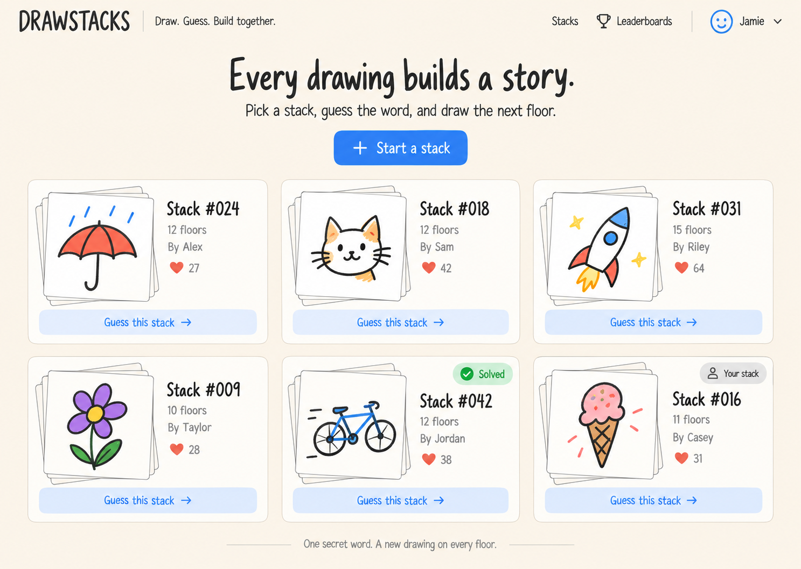
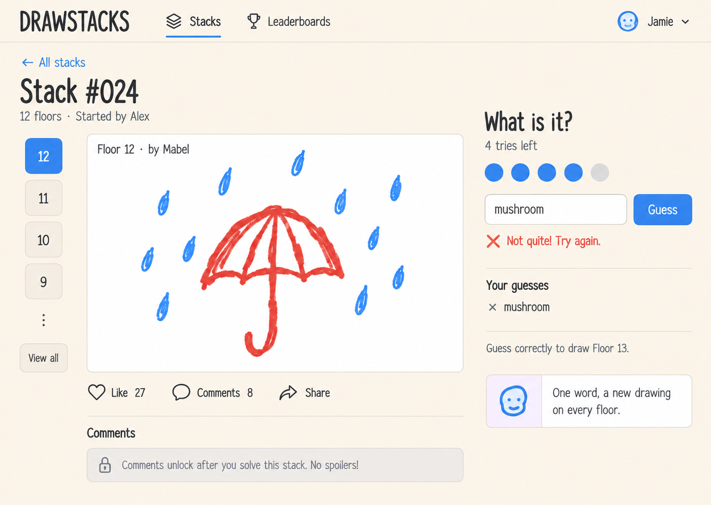
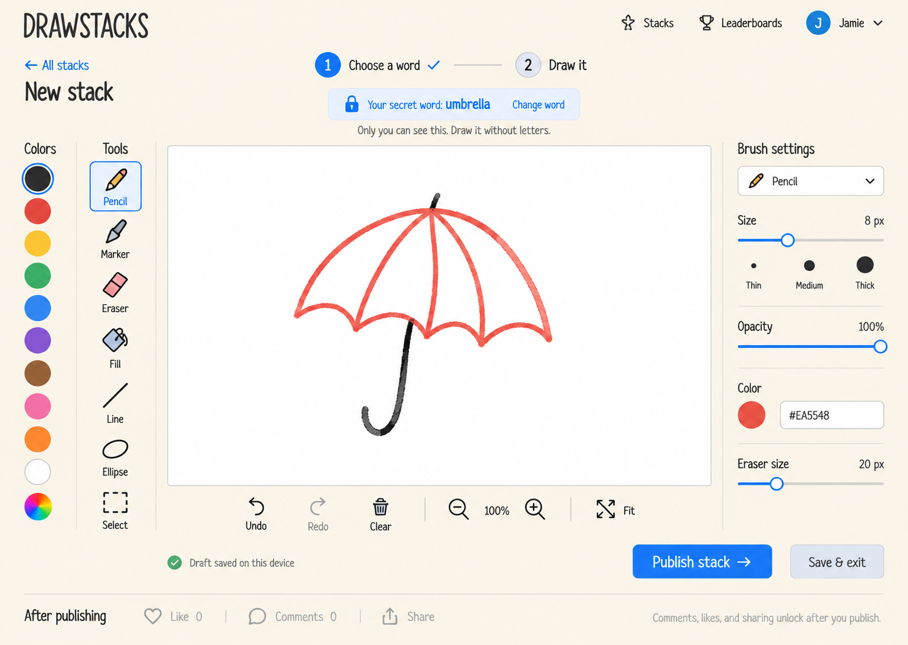
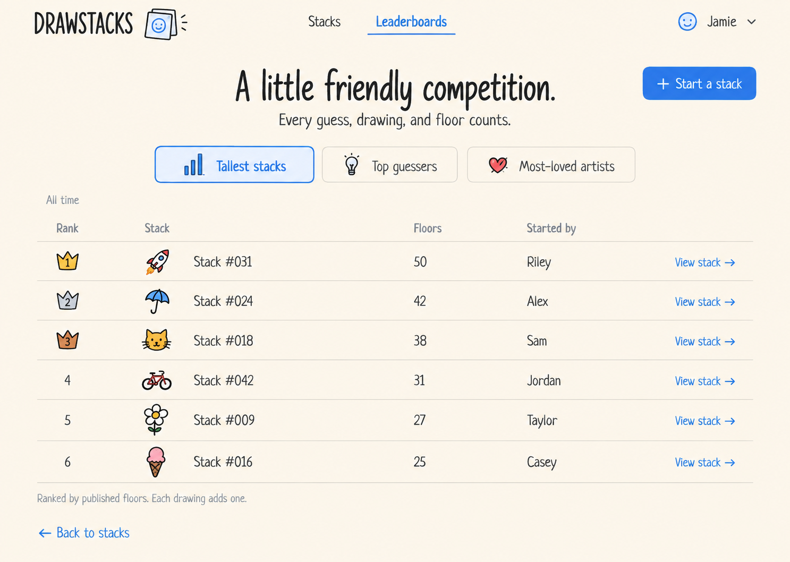

# DrawStacks

An English-language drawing, guessing, and relay game: **Draw. Guess. Build together.**

## Current status

The first playable local/LAN version is implemented: create stacks, draw, guess, relay, comment, like, share and explore three leaderboards. The initial database is genuinely empty; there are no invented players or scores.

Server rules, HTTP integration, persistence and the production build are verified. Browser interaction and visual acceptance status is recorded separately in [design-qa.md](design-qa.md); do not equate a successful build with a completed browser playtest.

## Run locally

Install **Node.js 24 LTS** (minimum 22.13). SQLite uses Node's built-in `node:sqlite`, so Python, a C++ compiler and a separate database service are not required. Older supported Node releases may print an experimental SQLite warning.

```sh
npm ci
npm run build
npm start
```

Open [http://localhost:3000](http://localhost:3000). For development, use `npm run dev` instead of the last two commands. Do not run development and production servers on the same port simultaneously.

The server listens on all local interfaces. For friends on the same trusted Wi-Fi/LAN, open `http://YOUR_LAN_IP:3000` on each device; permit the port through Windows Firewall only for the intended private network. Everyone must use the same reachable address. A shared `localhost` link does not work on another person's computer. Public hosting is **not configured** by a GitHub push.

## Play the first stack

1. Click **Start a stack**, choose a nickname, and enter your own **Accepted answers**. Separate alternative words or phrases with English commas, for example `ELON MUSK,马斯克`. Click **Save answers & draw**, then draw and publish Floor 1. There is no word bank.
2. Share its link with another browser profile, private window, device, or coworker. A second tab in the same browser normally shares the same player cookie.
3. That player enters **one** word or phrase. Matching **any** answer set by the current floor's artist wins: both `elon musk` and `马斯克` match the example above. English capitalization, surrounding/repeated whitespace and canonical Unicode spelling are normalized; partial matches and automatic synonyms are not accepted. Wrong answers consume one of five tries; one returns every minute.
4. The first correct guess reveals that floor's drawing, winning guess and full accepted-answer list in an automatic activity card. The artist receives an in-app notification. The winner must set a **new private answer list** before drawing the next floor. Artists may return later in an A → B → C → A relay; stacks finish at 50 floors.

Enter 1–10 distinct accepted answers, each up to 80 characters (809 total input characters). Any language is supported for player-entered content; all interface labels, help and errors remain English. Empty comma-separated entries and full-width commas are rejected with guidance. Duplicate answers are combined. Unfinished answer edits are saved with the draft. Existing single-answer stacks and drafts remain readable without resetting the database; the former hard-coded synonyms no longer apply.

Likes attach to the selected drawing's artist, not the stack founder. Comments unlock when that drawing is solved (and remain privately available to its artist beforehand). Rankings count floors, correct floor solves, and current drawing likes. Home, open stacks, activity cards and the notification bell poll for new activity while the page is visible.

## Drawing tools

Pencil and marker with separate remembered width/opacity, 10 colors and custom HEX, pixel eraser, connected fill with tolerance, line/rectangle/ellipse, rectangular select/move/delete, 50-step undo/redo, confirmed clear, zoom 25–200%, fit and pan. Hold Shift to constrain shapes; Space-drag pans. Keyboard: B/M/E/G/V/H, [ / ], Ctrl/Cmd+Z, Ctrl/Cmd+Shift+Z.

Drafts autosave to **this browser/device** after completed actions; a reload restores the drawing but not its undo history. `Save & exit` refuses to discard a draft if browser storage fails. Drawings publish as validated 960 × 640 PNGs. Blank drawings are rejected. Failed or conflicting publications keep the draft; a stale relay offers the latest floor for review before retrying.

## Data and identity

- Published state: `data/drawstacks.db` (SQLite WAL), including drawings and thumbnails. It survives server restarts. Set `DRAWSTACKS_DB` to use another persistent filesystem path.
- Private identity: opaque, HTTP-only, same-site browser cookie, valid for 30 days. The database stores a token hash; public user IDs cannot authenticate. Clearing/expiring cookies creates a new player; there is no password recovery or cross-device login in v1.
- Drafts: local storage, separated by player and stack. They are not uploaded before publication and are not synchronized across devices.
- Back up the database with the server stopped, or use a SQLite-aware backup tool. Do not copy only the main database while WAL writes are active.
- Never commit `data/`, cookies, `.env`, screenshots containing real private state, or production player data.

## Verify

```sh
npm run typecheck
npm test
npm run format:check
npm run build
npm run test:api
# Optional browser verification (install test browser once):
npx playwright install chromium
npm run test:browser
```

Unit tests use memory or a temporary isolated database. HTTP tests start a separate production server on port 3101; browser tests use port 3100. Both create new ignored databases under `data/` and never use the normal player database. A production build is required before integration/browser tests. Browser evidence is generated under ignored `test-results/qa/`; test runs clear old output. The browser suite covers two isolated players, drawing controls, draft recovery, answer/like/comment/relay workflows, share fallback, ranking tabs, and responsive captures.

## Implementation map

- `src/lib/game.ts`: authoritative rules, schema, validation, transactions, ranking and SQLite persistence.
- `src/app/api/[...path]/route.ts`: same-origin JSON API, cookie identity and image delivery.
- `src/components/GameApp.tsx`: home, identity, stack/guess/social flows and rankings.
- `src/components/DrawingEditor.tsx`: interactive Canvas editor and local draft lifecycle.
- `src/lib/paint.ts`: connected raster fill algorithm.
- `src/app/globals.css`: self-hosted Patrick Hand/Nunito typography, cream theme and responsive layouts.
- [Architecture and handoff](docs/implementation-v1.md)

## Scope and limits

This release is for trusted friends/LAN play. Anonymous cookies are **not** a public anti-cheat account system: people can create additional identities. No moderation, account recovery, drawing recognition, content reporting, distributed database, WebSocket push, or public deployment is included. Drawings can contain written hints; the app does not automatically police them. Activity uses short polling (3–5 seconds), so it is near-real-time rather than instant push. If a winning player never publishes the next drawing, v1 has no timeout or reassignment. SQLite and synchronous PNG processing suit small groups, not unmeasured public traffic.

The supported framework versions are locked in `package-lock.json`. They intentionally supersede the old Next.js 14 / Excalidraw assumptions: current Next.js is used, with a custom raster Canvas for true pixel erasing and fill. Node's built-in SQLite API is documented at [nodejs.org](https://nodejs.org/api/sqlite.html).

- [First-version design and acceptance scenarios](docs/design-v1.md)
- [Change history and development handoff](CHANGELOG.md)
- [Contribution instructions](AGENTS.md)
- [Mockup generation brief](docs/design-prompts.md)

## Design screens

### Home



### Stack detail and wrong-guess feedback



### Drawing editor



### Leaderboards



Mockups illustrate the design direction. The written specification defines interactions, ranking rules, and the corrections needed where individual image details differ.

## Next implementation milestone

Finish any browser/visual acceptance gaps recorded in `design-qa.md`, then conduct a real multi-device LAN playtest. Before public hosting, agree on persistent hosting, durable accounts, moderation and abuse controls.

## Team handoff

Before working, synchronize the current branch and read the latest changelog. Each development change must include a changelog entry describing changes, verification, limitations, and the next handoff. Commit and push the relevant code and documentation together; verify remote synchronization before reporting completion. Never commit credentials or live player data.
